[codepen]: https://codepen.io/ezquielgon2
[linkedin]: https://www.linkedin.com/in/ezequiel-gonzalez-macho-329583223
[udemy]: https://www.udemy.com/user/ezequiel-gonzalez-macho/
[gmail]: ezegonmac@gmail.com
[stackoverflow]: https://stackoverflow.com/users/11909334/egm2

### Hi there, I'm Ezequiel - aka @ezegonmac 👋 

## I'm a Software Engineer stablished in Seville, Spain

- 📚 Recent graduate in software engeneering currently in job hunting
- ❤️ In love with code and creating interactive websites
-  ☢  Learning REACT thoroughly
- ⚡ Fun facts: I used to do speedcubing 🎲, gym 🦾 and play the guitar 🎸

### You can find me in:

[][linkedin]
[][stackoverflow]
[][codepen]
[][udemy]

 

### Recent Projects:

<!-- <table>
<tr> -->

<td>
<table>
  <tr>
    <td>
      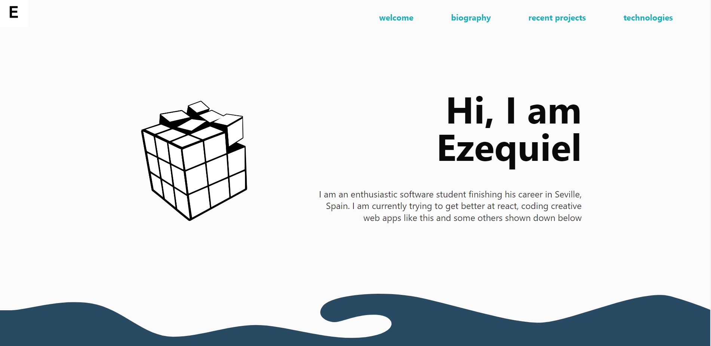
    </td>
    <td>
      <a href="https://ezegonmac.vercel.app/">2022 Portfolio - [Next.js minimalistic portfolio]</a>
    </td>
  </tr>
  
  <tr>
    <td>
      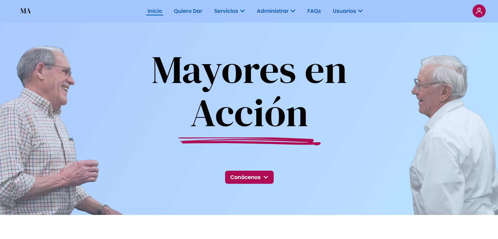
    </td>
    <td>
      <a href="https://mayoresenaccion.org">MA Web - [Next.js and MySQL Landing page and administrative web app]</a>
    </td>
  </tr>

  <tr>
    <td>
      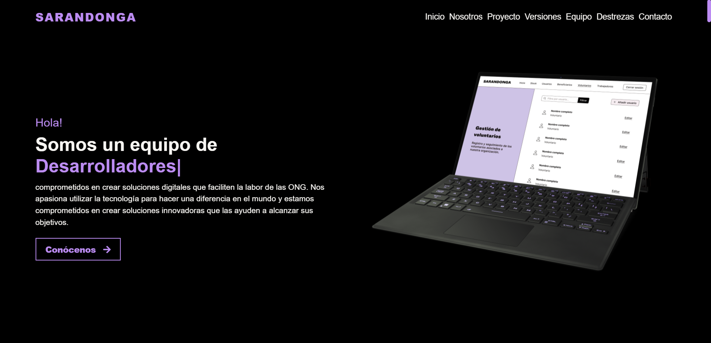
    </td>
    <td>
      <a href="https://github.com/ezegonmac/SarandONGa-LP">SARANDONGA - [Next Team Landing Page]</a>
    </td>
  </tr>
  
  <tr>
    <td>
      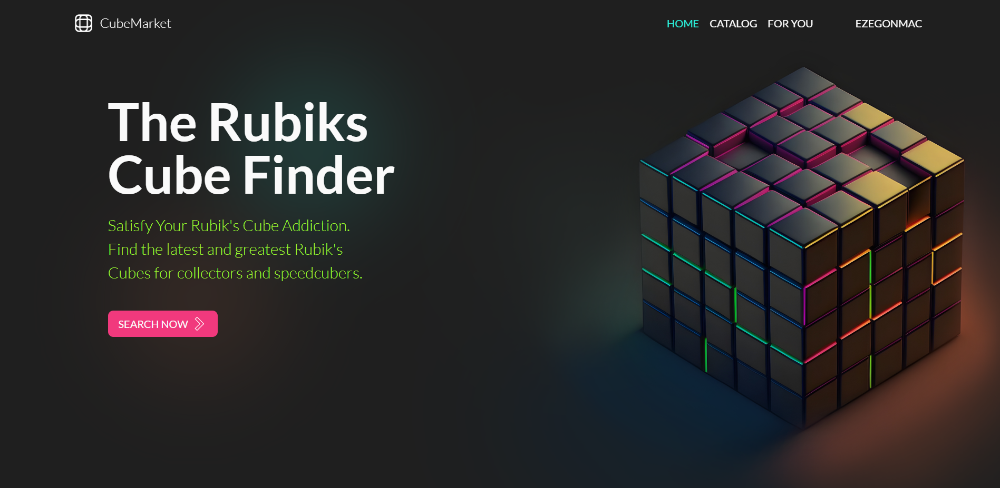
    </td>
    <td>
      <a href="https://github.com/ezegonmac/CubeMarket">CubeMarket - [Rubiks Cube comparator]</a>
    </td>
  </tr>
  
  <tr>
    <td>
      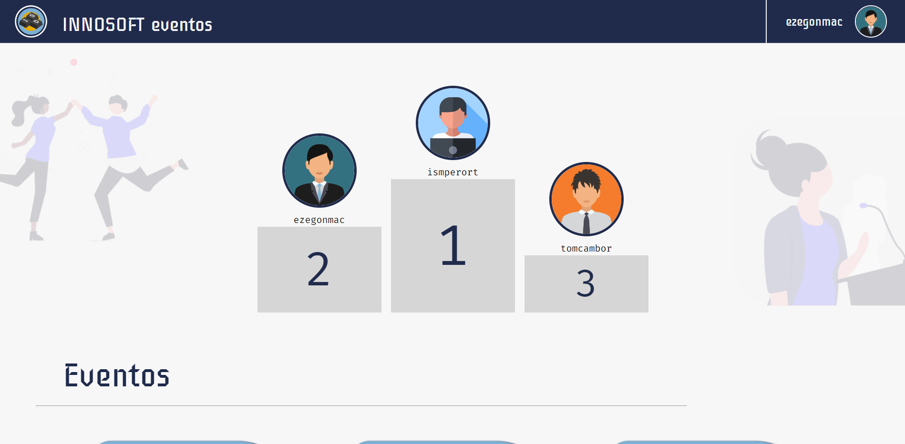
    </td>
    <td>
      <a href="https://github.com/innosoft-innoweb/innosoft-innoweb-1">Innoweb - [University days events web]</a>
    </td>
  </tr>

  <tr>
    <td>
      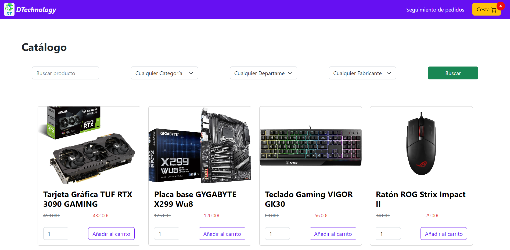
    </td>
    <td>
      <a href="https://github.com/ezegonmac/DTechnology">DTechnology - [PC components Marketplace]</a>
    </td>
  </tr>

  <tr>
    <td>
      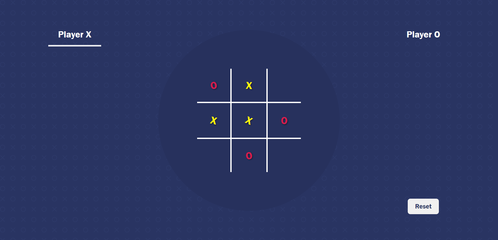
    </td>
    <td>
      <a href="https://ezegonmac.github.io/React-TikTakToe">React Tik Tak Toe - [The traditional game made reactive]</a>
    </td>
  </tr>

  <tr>
    <td>
      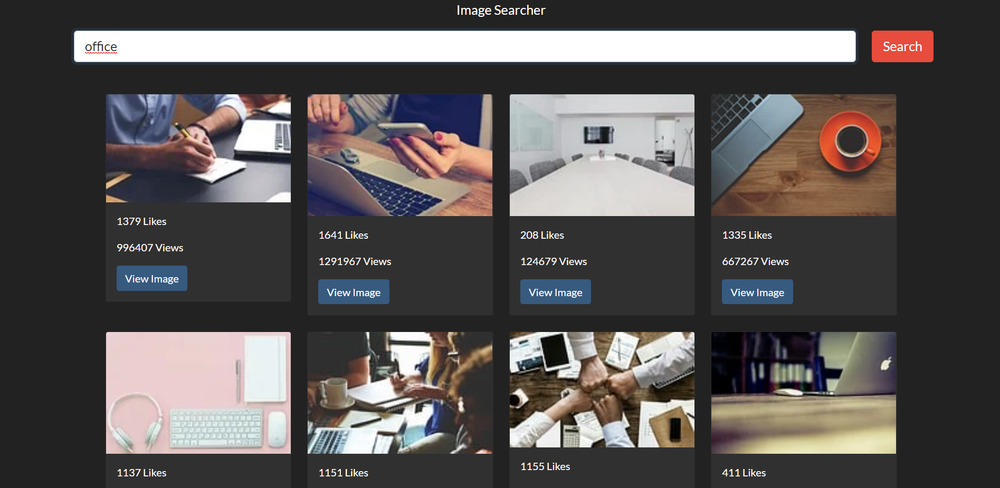
    </td>
    <td>
      <a href="https://github.com/ezegonmac/react-gallery/">React Gallery - [React app for practicing the fundamentals]</a>
    </td>
  </tr>

<!-- </table>
</td>

new column

<td>
<table> -->
  <tr>
    <td>
      
    </td>
    <td>
      <a href="https://ezegonmac.github.io/3d-curves/">Mandelbulb - [Playing with 3d point clouds in react]</a>
    </td>
  </tr>

  <tr>
    <td>
      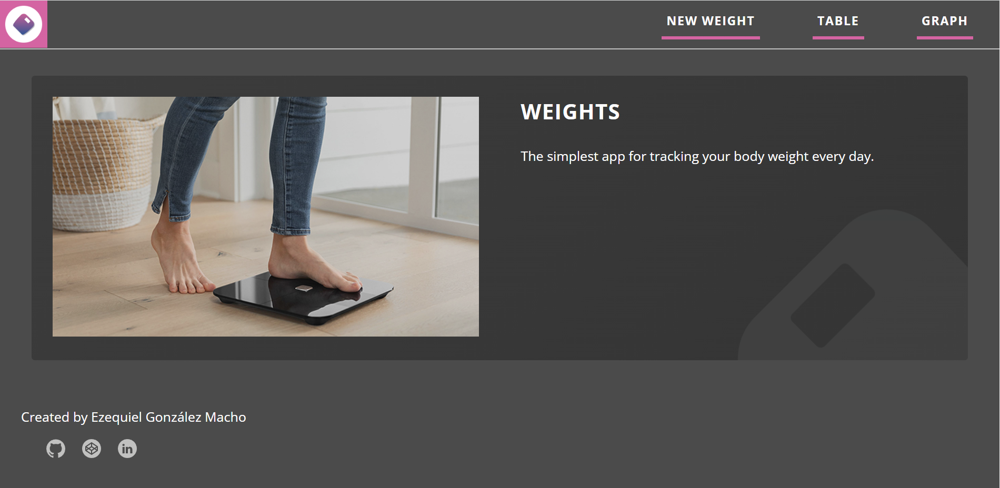
    </td>
    <td>
      <a href="https://ezegonmac.github.io/weights_react/">Weights - [Work in progress React app]</a>
    </td>
  </tr>
  
  <tr>
    <td>
      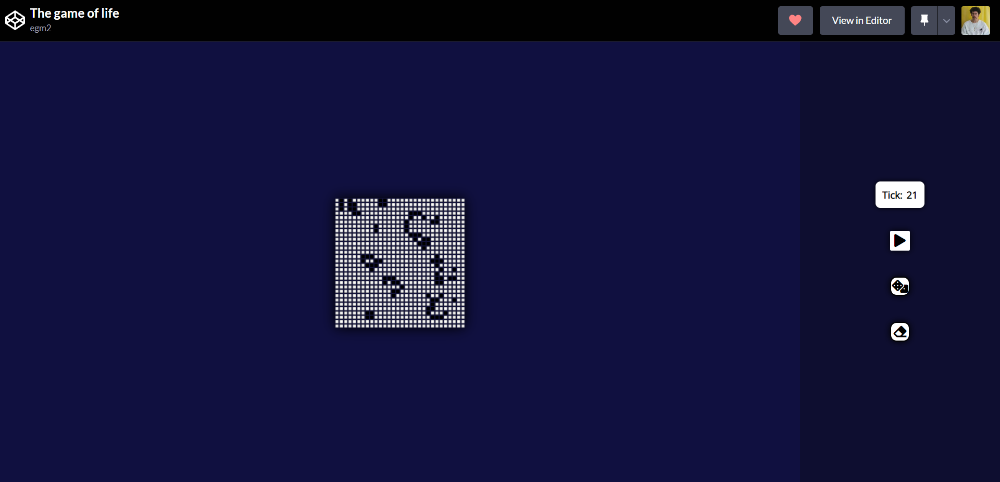
    </td>
    <td>
      <a href="https://codepen.io/ezquielgon2/pen/zYZmvmZ">The Game Of Life - [Vanilla JS simulator]</a>
    </td>
  </tr>

  <tr>
    <td>
      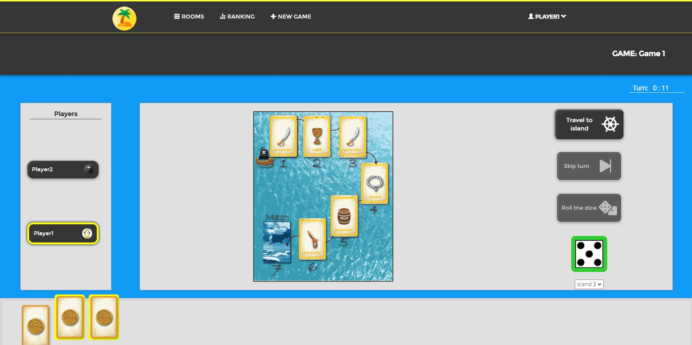
    </td>
    <td>
      <a href="https://github.com/ezegonmac/dp1-2021-2022-l8-1">Seven Islands - Spring web game [First real group project]</a>
    </td>
  </tr>

  <tr>
    <td>
      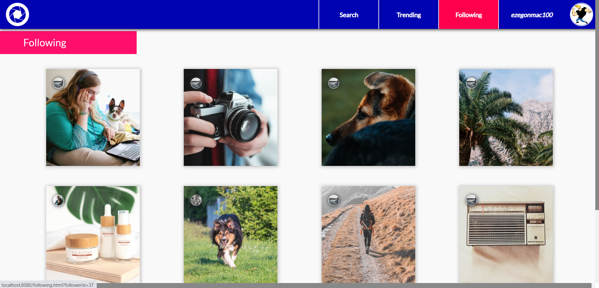
    </td>
    <td>
      <a href="https://github.com/ezegonmac/Proyecto-curso-IISSI2">Proyecto IISSI2 - Python Photo Social Network [First web app]</a>
    </td>
  </tr>

</table>
</td>

<!-- </table>
</td> -->

### Languages:

<table>
<tr>

<td>
<table>

  <tr>
    <td>
      
    </td>
    <td>HTML 5</td>
    <td>
      
      
      
    </td>
  </tr>

  <tr>
    <td>
      
    </td>
    <td>CSS 3</td>
    <td>
      
      
      
    </td>
  </tr>

  <tr>
    <td>
      
    </td>
    <td>JavaScript</td>
    <td>
      
      
      
    </td>
  </tr>

  <tr>
    <td>
      
    </td>
    <td>SQL</td>
    <td>
      
      
      
    </td>
  </tr>
</table>
</td>

<!-- new column -->

<td>
<table>

  <tr>
    <td>
      
    </td>
    <td>Java</td>
    <td>
      
      
      
    </td>
  </tr>

  <tr>
    <td>
      
    </td>
    <td>C</td>
    <td>
      
      
      
    </td>
  </tr>

  <tr>
    <td>
      
    </td>
    <td>Python</td>
    <td>
      
      
      
    </td>
  </tr>

  <tr>
    <td>
      
    </td>
    <td>R</td>
    <td>
      
      
      
    </td>
  </tr>

</table>
</td>

</tr>
</table>

<!-- ########################################################## -->

### Tools:

<table>
<tr>

<td>
<table>
  <tr>
    <td>
      
    </td>
    <td  width="145px">VSCode</td>
    <td>
      
      
      
    </td>
  </tr>

  <tr>
    <td>
      
    </td>
    <td>Eclipse</td>
    <td>
      
      
      
    </td>
  </tr>

  <tr>
    <td>
      
    </td>
    <td>Node.js</td>
    <td>
      
      
      
    </td>
  </tr>

  <tr>
    <td>
      
    </td>
    <td>Linux</td>
    <td>
      
      
      
    </td>
  </tr>

</table>
</td>

<!-- new column -->

<td>
<table>

  <tr>
    <td>
      
    </td>
    <td>Git</td>
    <td>
      
      
      
    </td>
  </tr>

  <tr>
    <td>
    
    </td>
    <td>GitHub</td>
    <td>
      
      
      
    </td>
  </tr>

  <tr>
    <td>
    
    </td>
    <td>Docker</td>
    <td>
      
      
      
    </td>
  </tr>

  <tr>
    <td>
    
    </td>
    <td>Selenium</td>
    <td>
      
      
      
    </td>
  </tr>
  
</table>
</td>

</tr>
</table>

<!-- ########################################################## -->

### Web Frameworks and Libraries:

<table>
<tr>

<td>
<table>

  <tr>
    <td>
      
    </td>
    <td>React</td>
    <td>
      
      
      
    </td>
  </tr>

  <tr>
    <td>
      
    </td>
    <td>Next</td>
    <td>
      
      
      
    </td>
  </tr>
  
  <tr>
    <td>
      
    </td>
    <td>Spring</td>
    <td>
      
      
      
    </td>
  </tr>

</table>
</td>

<!-- new column -->

<td>
<table>

  <tr>
    <td>
      
    </td>
    <td>Django</td>
    <td>
      
      
      
    </td>
  </tr>

  <tr>
    <td>
      
    </td>
    <td>Booststrap</td>
    <td>
      
      
      
    </td>
  </tr>

</table>
</td>

</tr>
</table>

<!-- ########################################################## -->

### React:

<table>
<tr>

<td>
<table>

  <tr>
    <td>
      
    </td>
    <td>Styled Components</td>
    <td>
      
      
      
    </td>
  </tr>

  <tr>
    <td>
      
    </td>
    <td>Redux</td>
    <td>
      
      
      
    </td>
  </tr>

  <tr>
    <td>
      
    </td>
    <td>MaterialUI</td>
    <td>
      
      
      
    </td>
  </tr>

</table>
</td>

<!-- new column -->

<td>
<table>

  <tr>
    <td>
      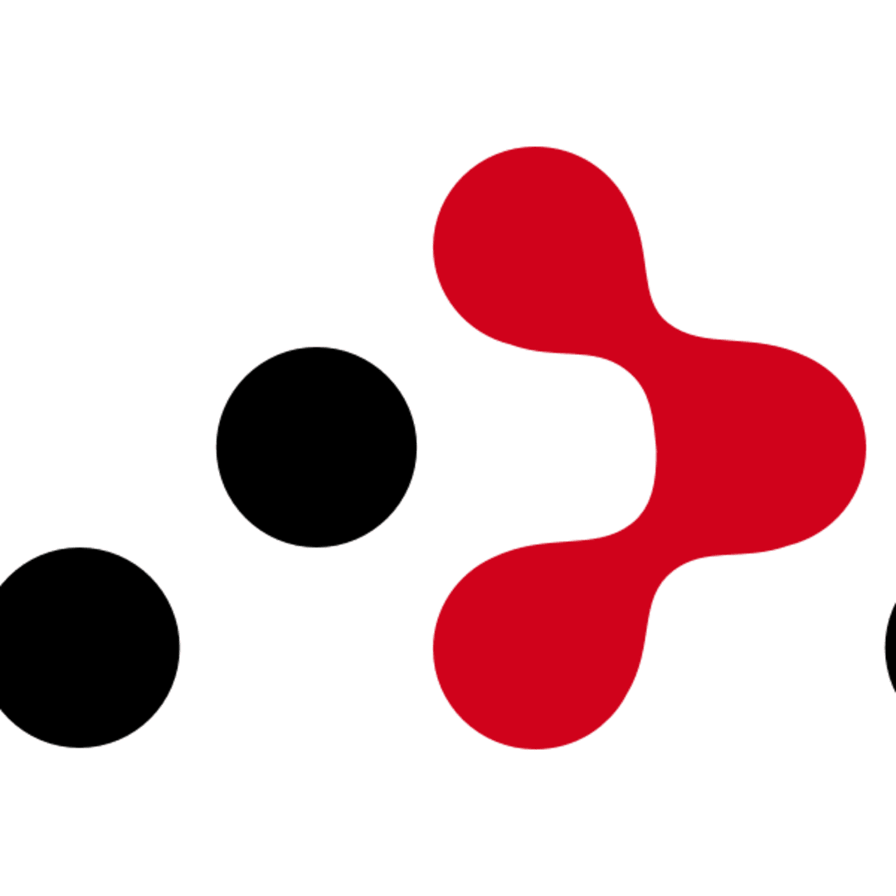
    </td>
    <td>React Router</td>
    <td>
      
      
      
    </td>
  </tr>

  <tr>
    <td>
      
    </td>
    <td>Framer Motion</td>
    <td>
      
      
      
    </td>
  </tr>

  <tr>
    <td>
      
    </td>
    <td>TailwindCSS</td>
    <td>
      
      
      
    </td>
  </tr>

</table>
</td>

</table>

 
 

---

### GitHub Stats

